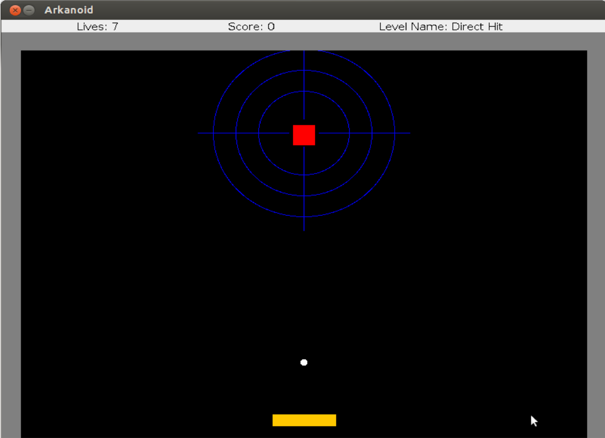
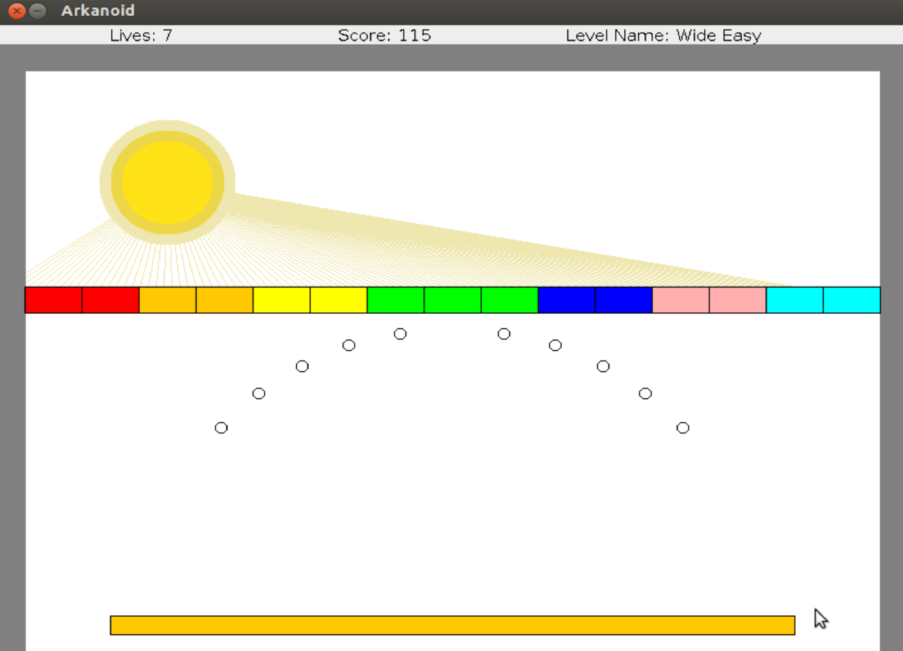
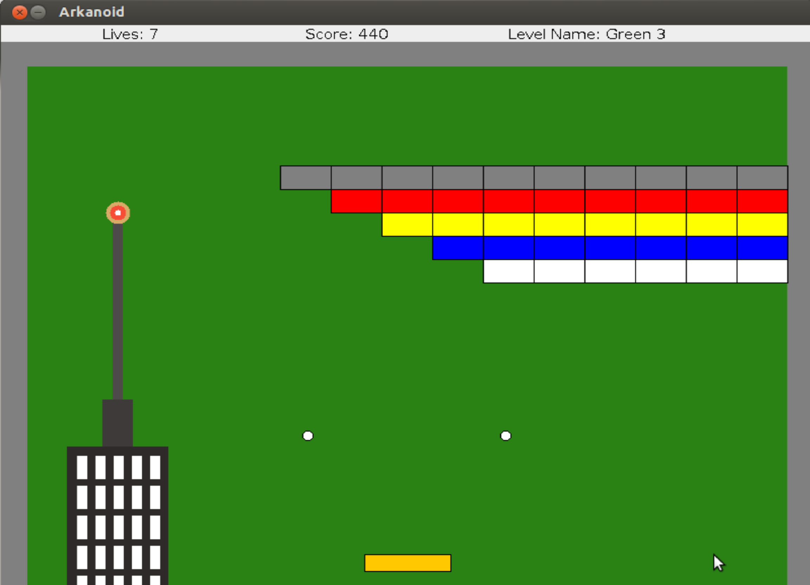
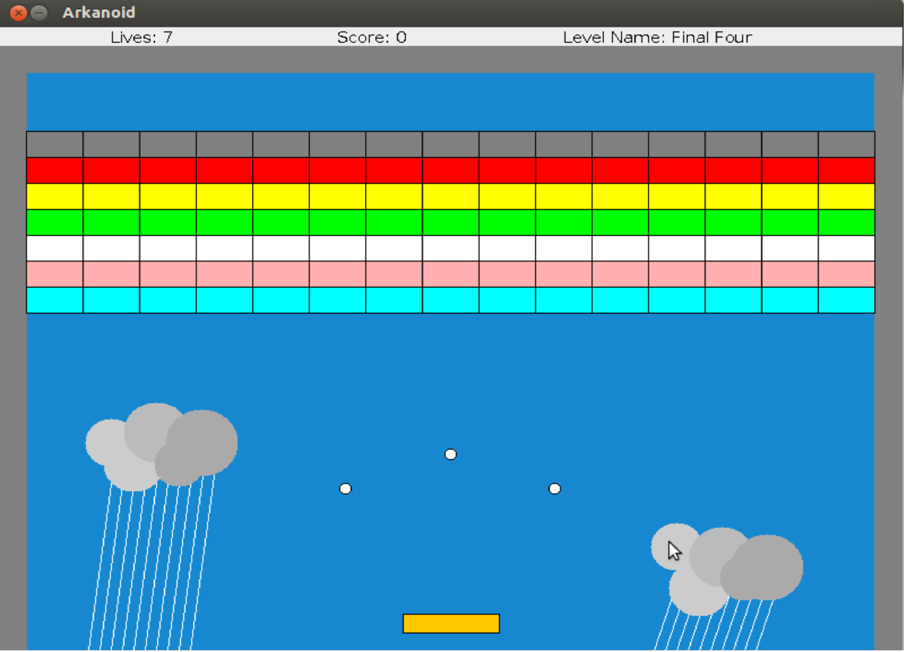
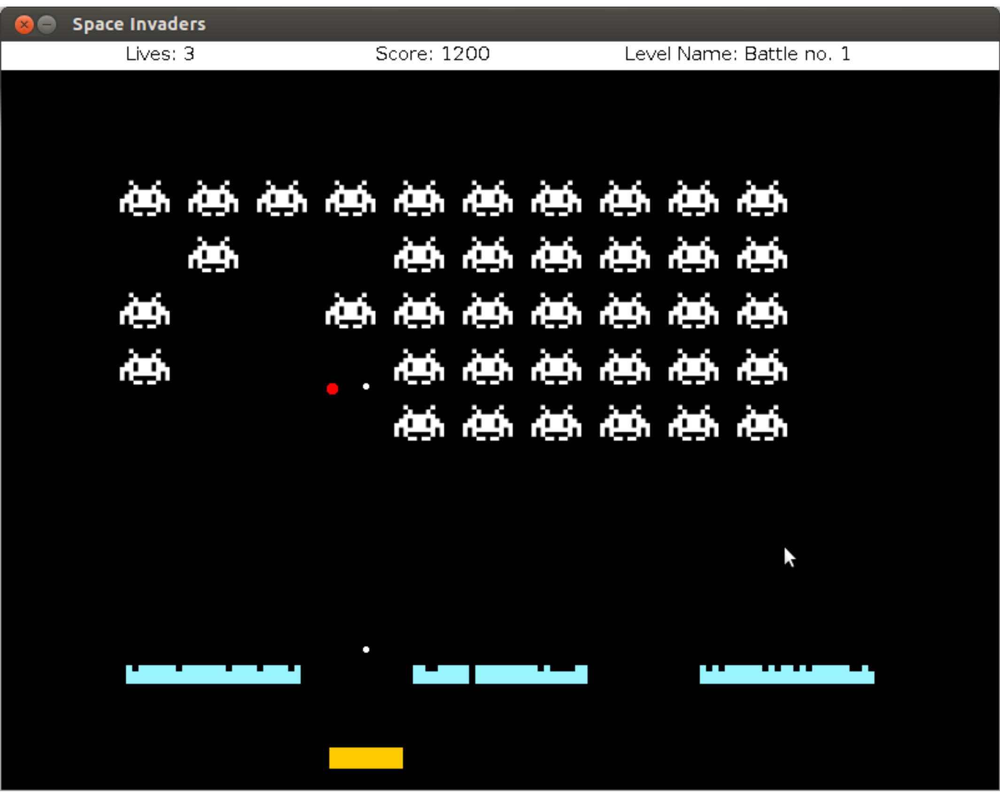

# Arkanoid-Game
Arkanoid Game - OPP version - java

General:

This project builds on top of the code that you developed for the Arakanoid game.

However, rather than adding features to the nice game we have, we will implement a brand new game.

We will be implementing a version of the classic 80s game Space Invaders.

When run without arguments, you should start a game with four levels that run one after the other.

When run with additional arguments, the arguments should be treated as a list of level numbers to run, in the specified order.

Discard (ignore) any argument which is not a number, or not in your levels range.

Running the game:

For example, running the game like this:

        java Ass5Game 3
        
Will run a game with level 3.

        java Ass5Game 1 3 2 1 9 1 bla 3 4 3
will run a game with the levels 1, 3, 2, 1, 1, 3, 4, 3.

Your game should behave similar to the following example: ass5example.jar. In order to run the example, download it to your computer, and then type (at the console) java -jar ass5example.jar.

The size of the screen should be 800 x 600.

 

And the final version of the game will be:

